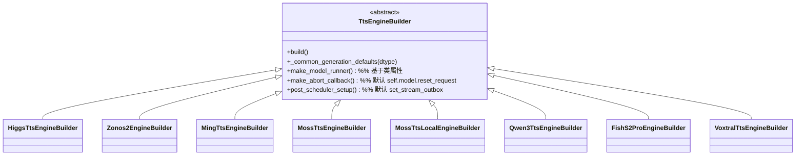

## 用户需求

在 sglang-omni 框架中，对 TTS 引擎构建器（Engine Builder）做一次主贡献级别的“去重重构” PR，目标是从 8 个高度重复的具体 builder 中抽取公共逻辑下沉到 `TtsEngineBuilder` 抽象基类，使每个具体 builder 退化为只声明差异点的“薄子类”。

## 产品概述

当前 8 个 TTS 模型（Higgs、ZONOS2、Ming、MOSS、MOSS-Local、Qwen3、FishAudio S2-Pro、Voxtral）各自实现了一份 `TtsEngineBuilder` 子类，其 `generation_defaults`、`make_model_runner`、`make_abort_callback`、`post_scheduler_setup` 等方法存在大量逐字重复（如 `make_model_runner` 均为 `importlib.import_module(...)` + 实例化，`post_scheduler_setup` 多为 `model_runner.set_stream_outbox(scheduler.outbox)`）。本 PR 在保持全部既有运行行为不变的前提下，将可复用的默认逻辑上移基类，降低新增模型接入成本并统一维护面。

## 核心特性

- 基类新增可覆盖的默认实现：`generation_defaults` 公共字段合并、`make_model_runner` 基于类属性自动实例化、`make_abort_callback` 默认返回 `self.model.reset_request`、`post_scheduler_setup` 默认绑定 stream outbox
- 8 个具体 builder 精简为差异声明（model_arch_override、pre_infra_setup、adjust_overrides、setup_model、compile_model、post_cuda_graph_setup、make_adapters、extra_scheduler_kwargs、__init__ 参数均保留）
- 补充/强化 `tests/unit_test/scheduling/test_engine_factory.py` 对默认实现的契约断言，确保回归安全
- 行为严格不变：所有 `stages.py` 调用方与 CI 测试不受影响

## 技术栈选型

- 语言：Python 3.10+（项目现有 `from __future__ import annotations`、`X | None` 语法）
- 架构：沿用现有 `TtsEngineBuilder(ABC)` 模板方法模式，不引入新框架
- 测试：pytest（沿用 `tests/unit_test/` 既有结构）

## 实现方案

**策略**：以模板方法模式为基础，将“稳定且雷同”的逻辑默认实现放进 `TtsEngineBuilder` 基类，子类通过类属性或少量钩子表达差异；对“语义敏感、模型特有”的逻辑（如 tokenizer/codec 加载、MoE 配置安装、radix/chunked_prefill 校验）保持子类 override，绝不合并。整体为纯重构，运行契约（`build()` 调用顺序与返回值）零变化。

**关键技术决策**：

1. `generation_defaults` 下沉：基类提供 `_common_generation_defaults(dtype)` 返回公共字段字典（`disable_cuda_graph`、`disable_overlap_schedule`、`enable_torch_compile`、`max_prefill_tokens=8192`、`sampling_backend="pytorch"`、`dtype`），子类 `generation_defaults` 调用基类后 `update` 自身差异字段（如 `max_running_requests`、`mem_fraction_static`、`cuda_graph_max_bs`、`chunked_prefill_size`、`random_seed`、`decrypted_config_file`、`quantization`）。注意：各模型 `disable_cuda_graph`/`enable_torch_compile`/`trust_remote_code` 取值不一，需以各子类当前值为准，基类仅提供“最常见默认”并允许子类显式覆盖，禁止改变现状。
2. `make_model_runner` 下沉：引入类属性 `model_runner_import_path: str` 与 `model_runner_class_name: str`，基类默认实现 `importlib.import_module(path).<Class>(model_worker, output_proc)`。无法用单一类名表达的特例（zonos2 需传 `compile_sampler`/`frame_graph`/`async_decode`/`stream_emit_*` 参数；ming 需缓存 `self._model_runner`；fish 逻辑相同但路径不同）由子类继续 override，基类只覆盖“两参数签名”的多数情况。
3. `make_abort_callback` 下沉：基类默认 `if getattr(self, "model", None) is not None: return self.model.reset_request; return None`。Higgs/zonos2/moss_tts_local 可删除重复实现；moss_tts/qwen3/voxtral 用 `request_builders` 清理函数、ming 用 `_model_runner.reset_request` 的子类继续 override。
4. `post_scheduler_setup` 下沉：基类默认 `model_runner.set_stream_outbox(scheduler.outbox)`。Higgs/moss_tts_local 可删除实现；其余空实现自动获得正确行为。

**性能与可靠性**：重构不改变运行期控制流与数值行为；GPU 启动路径、`init_device_graphs`、`capture_*_graphs` 均原样保留。无新增 I/O 或内存开销。基线测试 `test_engine_factory.py` 的 phase-order 断言保证 `build()` 编排不变。

**避免技术债**：严格复用现有抽象骨架（基类已预留 `NotImplementedError` 钩子），不新增第三种 builder 范式；每个子类删除的重复代码必须替换为对基类默认实现的依赖，而非保留双份。

## 实现注意

- **语义不变是硬约束**：每个子类 `generation_defaults` 合并公共字段后，最终字典必须与当前逐字返回的字典字节级等价（注意 `del dtype`、`del checkpoint_dir` 等 no-op 可删除；注意 Higgs/voxtral/fish 显式写 `"dtype": "bfloat16"` 而非用参数 `dtype` —— 合并时需保留该差异）。
- **trust_remote_code / disable_cuda_graph 取值不一**：ming 为 `False`、其余多为 `True`，务必按子类现状保留，不可误统一。
- **日志与警告**：保留 Higgs `adjust_overrides` 的 `mem_fraction_static` 校验 warning、各 builder 的 startup `logger.info`；迁移时不丢日志。
- **回归范围**：跑通 `tests/unit_test/scheduling/test_engine_factory.py` 与 5 个 `test_pipeline.py`；CI 标签 `run-ci` 触发 `test_zonos2_tts_ci.py`/`test_tts_ci.py` 等由 maintainer 执行，本 PR 不新增 CI 但需保证不破坏。
- **提交边界**：新开分支 `refactor/tts-engine-builder-dedup`，base 为 `main`；沿用身份 `1571859588 <1571859588@qq.com>`；不改动 `stages.py` 调用约定。

## 架构设计



重构后子类仅保留：类属性差异（model_arch_override、model_runner_*）、`generation_defaults`（合并公共+自身差异）、`pre_infra_setup`、`adjust_overrides`、`setup_model`、`compile_model`、`post_cuda_graph_setup`、`make_adapters`、`extra_scheduler_kwargs`、`__init__`。

## 目录结构

```
sglang_omni/
├── scheduling/
│   └── engine_factory.py                          # [MODIFY] TtsEngineBuilder 基类：新增 _common_generation_defaults、
│                                                   #         基于类属性的 make_model_runner 默认实现、make_abort_callback
│                                                   #         默认实现、post_scheduler_setup 默认实现。build() 编排不变。
├── models/
│   ├── higgs_tts/engine_builder.py                # [MODIFY] 删除重复的 make_model_runner/make_abort_callback/
│   │                                             #          post_scheduler_setup，generation_defaults 改用公共合并。
│   ├── zonos2/engine_builder.py                   # [MODIFY] make_abort_callback/post_scheduler_setup 下沉；
│   │                                             #          make_model_runner 因多参保留 override 或改类属性+partial。
│   ├── ming_tts/engine_builder.py                 # [MODIFY] 同上，make_adapters 依赖 _model_runner 保留 override。
│   ├── moss_tts/engine_builder.py                 # [MODIFY] 使用基类 make_model_runner 默认（两参签名）。
│   ├── moss_tts_local/engine_builder.py           # [MODIFY] 删除 post_scheduler_setup/make_abort_callback 重复。
│   ├── qwen3_tts/engine_builder.py                # [MODIFY] setup_model/compile_model 保留；make_model_runner 下沉。
│   ├── fishaudio_s2_pro/engine_builder.py         # [MODIFY] make_model_runner 下沉（两参签名）。
│   └── voxtral_tts/pipeline/engine_builder.py     # [MODIFY] make_model_runner 下沉；make_abort_callback 保留清理函数。
tests/
└── unit_test/scheduling/
    └── test_engine_factory.py                     # [MODIFY] 强化对基类默认实现（make_model_runner 自动实例化、
                                                    #          make_abort_callback 默认、post_scheduler_setup 默认、
                                                    #          _common_generation_defaults 字段）的契约断言。
```

## 关键代码结构

```python
# sglang_omni/scheduling/engine_factory.py（基类新增片段，接口级示意）
class TtsEngineBuilder(ABC):
    model_runner_import_path: str | None = None
    model_runner_class_name: str | None = None

    def _common_generation_defaults(self, *, dtype: str) -> dict[str, Any]:
        # 仅含跨模型一致的公共字段；各子类再 update 差异字段
        return {
            "disable_cuda_graph": False,
            "disable_overlap_schedule": True,
            "enable_torch_compile": False,
            "max_prefill_tokens": 8192,
            "sampling_backend": "pytorch",
            "dtype": dtype,
        }

    def make_model_runner(self, model_worker: Any, output_proc: Any) -> Any:
        # 类属性驱动；无法适配的子类继续 override
        mod = importlib.import_module(self.model_runner_import_path)
        return getattr(mod, self.model_runner_class_name)(model_worker, output_proc)

    def make_abort_callback(self) -> Any | None:
        model = getattr(self, "model", None)
        return model.reset_request if model is not None else None

    def post_scheduler_setup(self, scheduler: Any, model_runner: Any) -> None:
        model_runner.set_stream_outbox(scheduler.outbox)
```

## Agent Extensions

### SubAgent

- **code-explorer**
- Purpose: 在重构过程中对 8 个 builder 与 `stages.py` 调用点做精确比对，确认差异点清单、避免误合并语义敏感逻辑
- Expected outcome: 产出逐文件差异确认表，确保重构后行为字节级等价且 `stages.py` 调用方不受影响