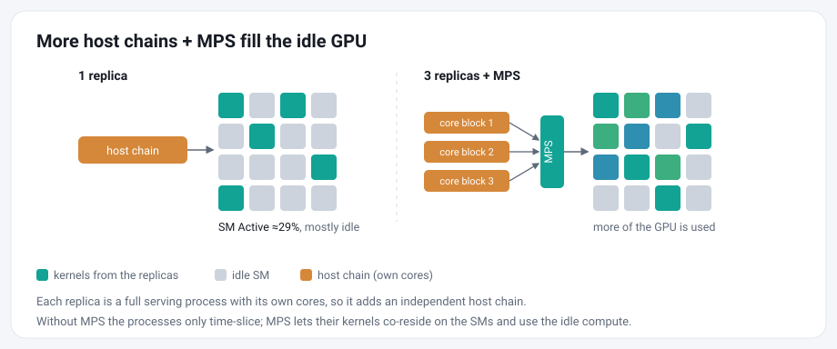
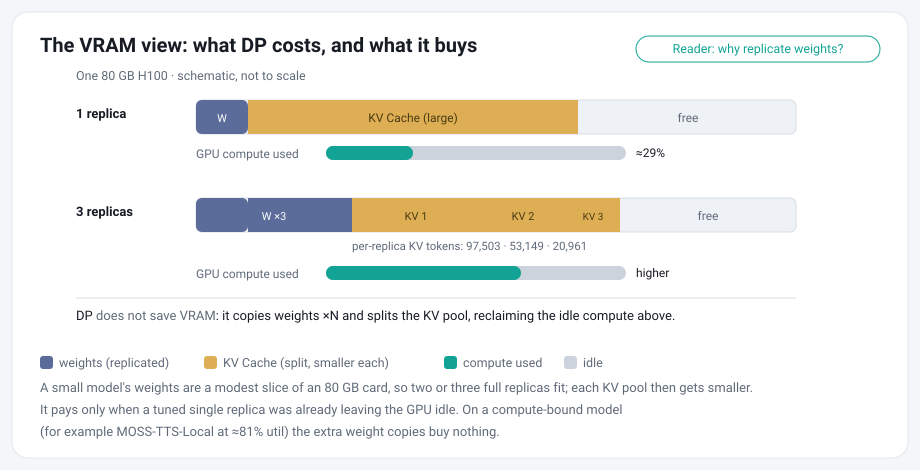
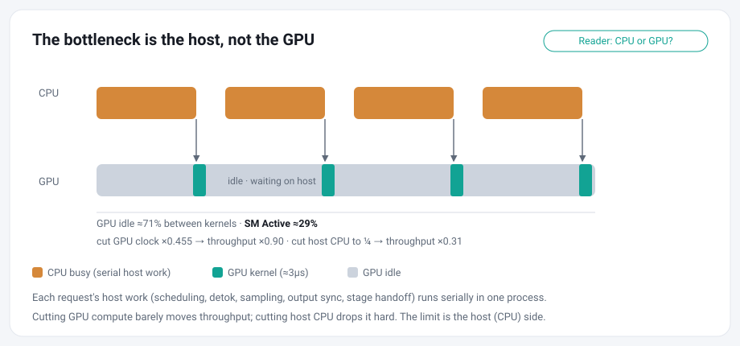

# Same-GPU Data Parallelism with CUDA MPS

> TL;DR: Same-GPU DP with CUDA MPS can substantially increase throughput. In the pinned TTS tests below, saturated DP2 and DP3 configurations reached 1.4 to 2.1x the tuned single-replica throughput.

A common data-parallel deployment assigns one GPU to each replica. When a tuned replica still leaves substantial GPU headroom, colocating multiple replicas on the same GPU can improve per-GPU throughput.

Same-GPU data parallelism runs several complete serving replicas on one GPU and lets [CUDA MPS](https://docs.nvidia.com/deploy/mps/index.html) share the GPU between them. This is a conditional and ongoing optimization. We are excited to share it and call for the community to join the exploration.



## Deploy

The steps below are one continuous flow. We provide `examples/mps_dp/launch.sh` to manage the private MPS daemon and serving replicas for one run. It records replica processes, ports, and logs, starts replicas sequentially, verifies their KV capacity and MPS attachment, and tears down only the run it recorded. Detailed instructions are as follows:

1. **Choose the GPU and NUMA node.**

```bash
nvidia-smi --query-gpu=index,utilization.gpu,memory.used --format=csv,noheader
export GPU_ID=0
BUS=$(nvidia-smi --query-gpu=pci.bus_id --format=csv,noheader -i $GPU_ID)
BUS=${BUS,,}; BUS=${BUS:4}
NODE=$(cat /sys/bus/pci/devices/$BUS/numa_node)   # if -1, set the node explicitly
numactl -H | grep "node $NODE cpus"
```

Pick a GPU that is idle, then find its NUMA node from the PCI bus id (drm card ordinals do not always match nvidia-smi ordinals). Choose non-overlapping physical CPU-core blocks from that node, one block per replica.

2. **Launch the replicas.**

```bash
CORE_BLOCKS="0-9 10-19 20-29" MAX_TOTAL_TOKENS=100000 bash examples/mps_dp/launch.sh up
```

The command above is the validated H100 Higgs DP3 recipe. The launcher uses three replicas by default, resolves the GPU's NUMA node, assigns one local port per replica, starts a private MPS daemon, waits for each replica's health check before starting the next, and verifies MPS attachment. The CPU blocks are specific to the tested host; derive the correct blocks for your own CPU topology.

The example leaves `--mem-fraction-static` unset and uses the model's existing default. Launching replicas sequentially avoids overlapping memory profiling and CUDA-graph capture during startup.

Identical `--mem-fraction-static` flags do **not** mean identical KV capacity. `--mem-fraction-static` budgets model weights and the KV pool against the GPU memory available when each replica starts. Roughly, the profiled KV memory is the requested fraction of free memory measured before model loading, minus model and fixed runtime allocations. It is a per-replica budget, not an additive share of the card. Because replicas start sequentially, earlier ones have already reserved memory, so later ones see a smaller free pool and allocate fewer KV tokens even when every flag is the same (in one run, three sequential `mf=0.27` replicas received 97,503 / 53,149 / 20,961 KV tokens).



Memory profiling does not coordinate KV allocation across independent replica processes. For `N > 1`, the launcher therefore requires one common `MAX_TOTAL_TOKENS` value and passes it to every replica as `--max-total-tokens`. SGLang treats this value as an upper bound; the launcher rejects startup unless every replica resolves exactly that capacity. The cap is independent of the request-level `max_new_tokens` limit and does not distribute requests between replicas.

The validated H100 Higgs DP3 cap is `100000` tokens per replica. This value is a starting point for the tested configuration, not a universal hardware default. Recalculate the cap after changing the model, GPU, runtime, replica count, memory settings, or CUDA-graph settings. If a replica cannot allocate the common cap, lower it or reduce the replica count.

3. **Drive every replica to saturation.**

The case study used one dedicated client per replica and drove all replicas in parallel. The measured goal is to keep every replica saturated. With equivalent replicas, random or round-robin routing can distribute a shared ingress across the pool; fill-one-then-next is another possible strategy, but the study did not compare them. Equal KV capacity makes the replicas comparable, but it does not by itself balance their queues. Validate the routing policy and per-replica saturation under your workload.

4. **Verify MPS attachment.**

MPS should be verified carefully. Four things are easy to conflate: environment variables set, daemon running, an MPS server exists, and the replica processes you launched are actually attached as clients. Only the last makes the comparison valid, and a replica that missed the pipe directory falls back to time-slicing without any error. The launcher verifies every replica against the MPS client list, writes the server-to-client PID mapping to `mps_attach.txt`, and fails startup if any replica is not attached.

5. **Route traffic.**

For easy deployment, you can register each replica endpoint with the [Omni Router](omni_router.md). Keep the router's `--max-connections` at least as large as the total offered concurrency. The case study did not benchmark router scheduling policies, so confirm that the selected policy keeps every replica driven and meets your workload's latency and throughput requirements.

6. **Tear down safely.**

Stop new traffic, then run the teardown command printed by the launcher:

```bash
bash examples/mps_dp/launch.sh down <RUN_ID>
```

On a shared host, only touch processes you launched, and never treat "the GPU is empty" as the success condition. The launcher stops only the replica processes recorded for the selected run, waits for their MPS clients to detach, and then stops the private MPS daemon. It keeps the run state whenever cleanup cannot be confirmed.

Setting up and tearing down MPS is more involved than running a single replica, but in the pinned H100 Higgs tests the throughput gain was substantial. The table below shows the nominal completed-run ranges; the full accounting, including the failed and degraded runs, is in the case study.


| Configuration | Nominal throughput | Relative to single |
|---|---:|---:|
| Single c96 | 21.7 to 22.1 qps | 1.0x |
| DP2 + MPS, 2 x c64 | 31.5 to 37.7 qps | 1.4 to 1.7x |
| DP3 + MPS, 3 x c64 | 39.9 to 46.9 qps | 1.8 to 2.1x |

These commands and the token cap are from an 80 GB H100 with Higgs and are not fixed recommendations for other GPUs. For H200, a validated reference configuration is given in the [H200 case study](#case-study-on-h200-with-higgs-tts-model) below. On other cards, repeat the sizing and saturation procedure and inspect every replica's actual allocation rather than reusing these values.


## How We Found This

This recipe grew out of the serving profiling in [#907](https://github.com/sgl-project/sglang-omni/issues/907). Our profiling found substantial unused GPU capacity across several omni serving workloads, with strong host-dispatch-bound evidence in the tested ASR setup. From there we ran same-GPU DP experiments on [Higgs](https://sgl-project.github.io/sglang-omni/cookbook/higgs_tts.html) and [Moss](https://sgl-project.github.io/sglang-omni/cookbook/moss_tts_local.html) TTS models.



| Experiment | GPU signal | Controlled observation | Result | Interpretation |
|---|---|---|---|---|
| ASR single replica | GPU timeline 94.3% idle | throughput 0.90x at SM clock 0.455x; 0.31x at host CPU near 0.25x | sensitive to CPU, not to GPU compute | strong host-dispatch-bound causal evidence in this ASR setup |
| Higgs tuned single | SM Active about 29%, GPU idle about 71% | throughput plateaued, worker fully driven | 1.00x normalized | clear reclaimable GPU headroom, but not the full ASR causal closure |
| Higgs DP2 without MPS | SM Active about 37 to 38%, GPU idle about 62 to 63% | added a second same-card server process | about 1.24x normalized | the second process reclaims part of the idle gap; host scheduling and long-tail batching can both contribute |
| Higgs DP with MPS | see the pinned case study in Evaluate | each replica saturated, MPS attachment confirmed | 1.4 to 2.1x nominal, repeated | MPS-enabled saturated runs produced the largest gains observed in the later pinned tests. |

ASR is the strongest host-bound evidence. Higgs started as a gray zone but clearly leaves GPU headroom at a tuned single replica. Running several replicas as separate processes changes host execution, scheduling, and long-tail behavior, and it is not the same as enlarging one replica's batch. Without MPS the CUDA contexts mostly time-slice and recover only part of the idle; MPS lets kernels from different processes run concurrently when resources permit, and the later MPS-enabled saturated runs produced the largest gains observed in the pinned tests.

## Common questions

**Throughput has plateaued, so why is the GPU still idle?**

Serving throughput depends on more than the GPU's peak compute. It also depends on how much parallel work a single replica exposes per step, how fast the host side handles scheduling and stage handoffs, and the request-length and batching distribution. A single Higgs replica can have a full request queue and still sit at about 29% SM Active; adding a second independent replica improves GPU idle and throughput together. So one process's serving path is not keeping the card fed, but the cause is not a single CPU function: multiple host execution paths, batching behavior, and a latency-bounded decode shape can all contribute.

**Replicating the weights costs VRAM. What does that buy?**

Same-GPU DP does not save VRAM; it spends more of it. It copies the weights per replica and gives each replica its own, smaller KV pool. What it buys is the otherwise idle compute, reclaimed. That trade pays off only when a tuned single replica leaves the GPU idle (so there are idle SMs to fill) and the model is small enough that its weights are a modest slice of the card, so two or three full replicas still fit. On a compute-bound model, or one too large to hold several weight copies, extra replicas buy little.

## Reproduce the results

We release our early results and the guidance to reproduce them below.

### Prepare the baseline

The single-replica baseline decides whether same-GPU DP is worth it, and an under-driven baseline makes DP look better than it is. Tune and measure one replica first, then treat its throughput, latency, and GPU utilization as the number every DP configuration has to beat.

* **Sweep concurrency to the plateau.** Raise client concurrency until throughput stops climbing, and read the scheduler log lines (`#running-req`, `#queue-req`) at each step rather than assuming a good operating point.
* **Know the admission limit.** Higgs serves with `max_running_requests=64` and `cuda_graph_max_bs=64` by default; both can be raised via `sgl-omni serve --max_running_requests N --cuda_graph_max_bs N` (the CUDA-graph capture range must cover the admission limit, and raising it costs capture memory). Whether the default cap binds depends on the runtime, so check the queue, do not assume.
* **Separate client from server.** Client concurrency is not the active generation batch: requests beyond the admission limit wait in the scheduler queue, and requests also spend time in the other pipeline stages.
* **Prerequisites.** NVIDIA CUDA MPS available with GPU compute mode `Default`, so a per-user daemon needs no root; enough GPU memory for every replica's common KV cap plus roughly fixed per-replica overhead (weights, codec, MPS context); non-overlapping CPU core blocks, one per replica, on the GPU's NUMA node (on SMT machines logical CPUs `N` and `N + ncores` are often the same physical core, so check `lscpu -e=CPU,CORE,NODE`); and enough offered concurrency to saturate each replica, not just the pool.


### Evaluate

Whether same-GPU DP helps is easy to measure incorrectly, so hold the comparison to the same discipline for every configuration:

| Control | Why it matters |
|---|---|
| tune the single replica to its throughput plateau | keeps the baseline from being artificially weak |
| hold total GPU and CPU resources fixed | separates replica splitting from simply adding resources |
| give each replica dedicated CPU cores | keeps replicas from contending for host dispatch |
| saturate each replica separately | keeps the DP pool from being under-fed |
| pin software and runtime settings | makes the comparison reproducible |
| report latency and unsuccessful runs | avoids showing only the best throughput |

## Case Study on H100 with Higgs TTS Model

One H100 80 GB (driver 580.126.20 / CUDA 13), sglang-omni `a78de4cb`, sglang `0.5.12.post1`, `bosonai/higgs-tts-3-4b` (snapshot `7556c17e`), `/v1/audio/speech`, seed-tts-eval EN, 300 samples per client, default `max_running_requests=64` / `cuda_graph_max_bs=64`, 32 server cores of the GPU's NUMA node split per replica, one client per replica on the SMT-sibling cores, fresh servers per run, interleaved on a shared host. Every attempted run is reported.

| Configuration | Nominal throughput | Relative to single | Run outcome |
|---|---:|---:|---|
| Single c96 | 21.7 to 22.1 qps | 1.0x | 4/4 completed |
| DP2 + MPS, 2 x c64 | 31.5 to 37.7 qps | 1.4 to 1.7x | 3 nominal of 5 attempts |
| DP3 + MPS, 3 x c64 | 39.9 to 46.9 qps | 1.8 to 2.1x | 2 nominal and 1 degraded of 4 attempts |

The failures: one DP2 benchmark run hit `cudaErrorMpsRpcFailure`, and one DP2 and one DP3 replica failed to start, all coinciding with host-load spikes. One DP3 run completed every request but at 13.3 qps, so it is marked degraded rather than excluded. The core-pinned single stayed within a few percent across all runs, and DP3 was not clearly repeatably better than DP2.

Note: the `--max-total-tokens` option makes per-replica KV sizing more explicit and comparable. It is not a direct fix for `cudaErrorMpsRpcFailure`, and the launch and runtime failure rate has not been re-measured with it in place; the failures in the table reflect the runs as recorded.

The #907 profiling, this repeated case study, and the reviewer verification below are three separate measurement series. They ran on different dates and load, and in some cases different software, so they should not be compared by absolute QPS; the differences between roughly 61, 21, and 29.9 qps are not attributed to a single cause.

> A separate reviewer verification on the same pinned software revision measured 29.9, 59.7, and 64.5 qps for single, DP2, and DP3. Absolute throughput differed between the two runtime environments, including different observed admission behavior, so the two series should not be combined. Both nevertheless showed a clear DP gain once every configuration was saturated.

To measure your own setup, check whether one tuned replica is below GPU saturation under your real workload before adopting DP:

```bash
nvidia-smi dmon -i $GPU_ID -s um -d 5                        # coarse utilization
nsys profile --gpu-metrics-devices $GPU_ID --gpu-metrics-set gh100 \
  -d 60 -o one_replica -f true sleep 63                      # device-level SM-active
```

Low SM activity at the tuned single replica's peak may indicate reclaimable headroom; confirm it with a controlled DP comparison before relying on it. If SM activity is already near the ceiling, stop here.

## Case Study on H200 with Higgs TTS Model

One H200 141 GB SXM (driver 590.48.01 / CUDA 13), sglang-omni `1618b7c`, sglang `0.5.12.post1`, `bosonai/higgs-tts-3-4b` (snapshot `7556c17e`), seed-tts-eval EN voice clone via `/v1/chat/completions`, default `max_running_requests=64` / `cuda_graph_max_bs=64`, `--max-total-tokens 100000` for every condition including the single-replica baseline, 32 NUMA-local server cores split per replica, one closed-loop client per replica (conc 96) on disjoint physical cores, fresh servers and a fresh MPS daemon per rep, 2 reps per condition, device-level SM Active % from 60 s `nsys --gpu-metrics` windows (the same-card DP profiling tooling). Because the client path, concurrency, and KV pinning differ from the H100 case study above, absolute qps is not comparable between the two studies; compare the ratios.

| Configuration | Nominal throughput | SM Active | Relative to single |
|---|---:|---:|---:|
| Single c96 | 50.2 to 50.8 qps | 20% | 1.0x |
| DP2 + MPS, 2 x c96 | 93.2 to 93.9 qps | 39 to 40% | 1.9x |
| DP3 + MPS, 3 x c96 | 129.6 to 132.1 qps | 56% | 2.6x |
| DP4 + MPS, 4 x c96 | 157.6 to 159.7 qps | 69 to 70% | 3.2x |
| DP5 + MPS, 5 x c96 | 177.6 to 180.7 qps | 79% | 3.6x |
| DP6 + MPS, 6 x c96 (`--mem-fraction-static 0.95`) | 190.7 to 191.4 qps | 86% | 3.8x |

Without MPS the same sweep plateaus at 1.65 to 1.77x from DP3 through DP5 (SM Active 33 to 36%): time-slicing recovers only part of the idle, and MPS remains the unlock at every depth.

**Stability.** A fresh DP5+MPS stack held 30 minutes of sustained saturation (5 clients x conc 96) at 176.4 qps aggregate with zero request errors, zero `MpsRpc`/CUDA-error lines in any replica log, per-replica throughput drift within +/-1.7%, and a clean teardown; five consecutive up/down cycles (fresh MPS daemon each) completed 5/5. Under sustained load each replica settles ~0.6 GB above its fresh-start footprint; account for that when sizing.

**Equal-KV capacity.** Each replica at the 100000-token cap occupies 22.84 GB fresh (weights 7.60 + KV 13.74 + CUDA graph 0.29 + runtime). The largest common `--max-total-tokens` validated to start with every replica resolving the full cap, at the default mem fraction: **400000 for DP2, 250000 for DP3, 170000 for DP4, 130000 for DP5, 80000 for DP6** (DP6 also starts at 100000 with `--mem-fraction-static 0.95`). These are startup-validated ceilings, not tuned recommendations; every throughput row above ran at 100000.

**Recommended deployment.** The validated H200 Higgs configuration is `N=5` with `MAX_TOTAL_TOKENS=100000`, launched exactly as in the Deploy section. DP6 is the measured ceiling, not the operating point: it adds only +6% over DP5, needs `--mem-fraction-static 0.95` to fit, and leaves only ~3.3 GB of VRAM fresh — the ~0.6 GB per-replica warm-up growth alone consumes nearly all of it, so DP6 has no safety margin for production serving.

The detailed experimental process is in the issue [#1066](https://github.com/sgl-project/sglang-omni/issues/1066).

## Limits and next steps

1. **Generality is not fully validated.** The pinned case studies now cover H100 and H200 with Higgs; we also used SGLang to serve Qwen3-4B directly, which likewise confirmed the same-GPU DP gains. We believe same-GPU DP is a promising direction for smaller models on GPUs with ample memory and compute headroom, but the experimental coverage is still incomplete.

2. **KV sizing is hardware- and workload-specific.** The launcher enforces equal per-replica KV capacity through a common `--max-total-tokens`. A sizing procedure that generalizes across models, runtimes, and GPU configurations still requires further study.

3. **Router and scheduler still need a deeper dive.** Both the router and the SGLang Omni scheduler need further optimization. On the router side, better routing strategies for a colocated pool are clearly required. On the scheduler side, a more ambitious question is whether we can borrow the spirit of LLM prefill–decode (PD) disaggregation: keep one large shared KV cache and let multiple replicas share it. That direction is extremely challenging, and we believe the potential payoff is correspondingly large.

Same-GPU DP with MPS can recover idle GPU time on host- or dispatch-bound serving today, but broader validation and the work above are still unfinished. If this direction interests you, or you have results from other models, GPUs, or workloads that confirm or challenge these findings, we would like to work with you.
