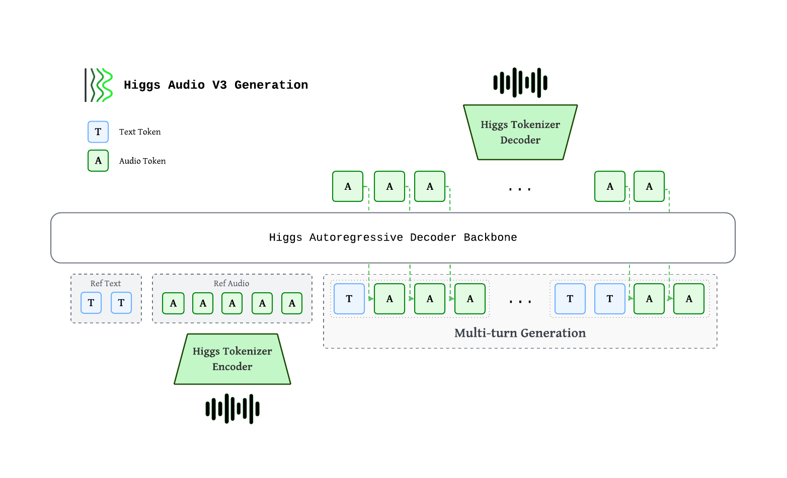

# Higgs TTS

[Higgs Audio v3 TTS](https://huggingface.co/boson-sglang/higgs-audio-v3-TTS-4B-grpo05200410999)
is a chat-native text-to-speech model from Boson AI built on a Qwen3-4B backbone. It generates
24 kHz speech through 8 discrete codebooks and supports 100+ languages, voice cloning from a
reference clip, and fine-grained inline control over emotion, style, sound effects, and prosody.

## Highlights

- **Chat-native, low-latency** streaming multi-turn speech generation
- **Multilingual** — 100+ languages and dialects, 90+ with single-digit WER/CER
- **Voice clone accuracy** — high-fidelity zero-shot speaker cloning from reference clips
- **Inline control** via `<|emotion:…|>`, `<|style:…|>`, `<|sfx:…|>`, `<|prosody:…|>` tags

## Architecture



Higgs autoregressive decoder consumes interleaved text and audio tokens. Audio is encoded by the **Higgs Tokenizer** into 8 codebooks at 25 fps, staggered via a **delay pattern**, then mapped to backbone hidden states through a **multi-codebook fused embedding**. Output codes pass through a **multi-codebook fused head**, are de-delayed, and decoded back to waveform. Multi-turn generation interleaves `<|text|>…<|audio|>…` chunks so each new chunk is grounded on reference + prior chunks.

| Component | Spec |
|---|---|
| Backbone | ~4B autoregressive decoder (36 L, hidden=2560, GQA 32/8) |
| Audio tokens | 8 codebooks × 1026 vocab, delay pattern |
| Multi-codebook embedding / head | Fused single-tensor, tied with text embedding |
| Context length | 8,192 tokens (training sequence length) |

## Prerequisites

Install `sglang-omni` by following [Installation](../get_started/installation.md), then download the model:

```bash
# Higgs TTS model is private; export your HF token before downloading.
export HF_TOKEN=hf_xxxxxxxxxxxxxxxxxxxxxxxxxxxxxxxxxxxx
hf download boson-sglang/higgs-audio-v3-TTS-4B-grpo05200410999
hf download bosonai/higgs-audio-v2-tokenizer
```

## Server Configuration

The pipeline is `preprocessing → audio_encoder → tts_engine → vocoder`.

```bash
sgl-omni serve \
  --model-path boson-sglang/higgs-audio-v3-TTS-4B-grpo05200410999 \
  --port 8000
```

## Synthesizing Speech

### Zero-shot

1. Use curl

```bash
curl -X POST http://localhost:8000/v1/audio/speech \
  -H "Content-Type: application/json" \
  -d '{"input": "Hello, how are you?"}' \
  --output output.wav
```

2. Use Python

```python
import requests

resp = requests.post(
    "http://localhost:8000/v1/audio/speech",
    json={"input": "Hello, how are you?"},
)
resp.raise_for_status()
with open("output.wav", "wb") as f:
    f.write(resp.content)
```

Reference output:

<audio controls>
  <source src="../_static/audio/higgs-1.wav" type="audio/wav">
</audio>

### Voice Cloning

Supplying the reference transcript (`text`) materially improves cloning quality.

1. Use curl

```bash
curl -X POST http://localhost:8000/v1/audio/speech \
  -H "Content-Type: application/json" \
  -d '{
    "input": "Have a nice day and enjoy south california sunshine.",
    "references": [{
      "audio_path": "docs/_static/audio/male-voice.wav",
      "text": "Hey, Adam here. Let'\''s create something that feels real, sounds human, and connects every time."
    }],
    "temperature": 0.8,
    "top_k": 50,
    "max_new_tokens": 1024
  }' \
  --output output.wav
```

2. Use Python

```python
import requests

resp = requests.post(
    "http://localhost:8000/v1/audio/speech",
    json={
        "input": "Have a nice day and enjoy south california sunshine.",
        "references": [{
            "audio_path": "docs/_static/audio/male-voice.wav",
            "text": "Hey, Adam here. Let's create something that feels real, sounds human, and connects every time.",
        }],
        "temperature": 0.8,
        "top_k": 50,
        "max_new_tokens": 1024,
    },
)
resp.raise_for_status()
with open("output.wav", "wb") as f:
    f.write(resp.content)
```
Reference input:

<audio controls>
  <source src="../_static/audio/male-voice.wav" type="audio/wav">
</audio>

Reference output:

<audio controls>
  <source src="../_static/audio/higgs-2.wav" type="audio/wav">
</audio>

### Streaming

Unlike a standard request where you wait for the full audio to be generated before receiving anything, streaming lets you start receiving and playing audio **while generation is still in progress**. This significantly reduces time-to-first-audio, which matters for real-time or interactive use cases.

Higgs TTS implements streaming via [Server-Sent Events (SSE)](https://developer.mozilla.org/en-US/docs/Web/API/Server-sent_events). Each SSE event carries a base64-encoded WAV chunk. Your client can decode and play each chunk as it arrives, rather than buffering the entire response.

Enable streaming by setting `"stream": true` in the request body. During generation, the vocoder emits incremental audio chunks; the terminal event is intentionally slim and carries metadata such as `sample_rate` and `usage` instead of repeating the full waveform. Inside the pipeline, audio chunks use the compact `audio_waveform` payload (`bytes` plus `audio_waveform_shape`, `audio_waveform_dtype`, and `sample_rate`), which the HTTP layer encodes into the SSE `audio.data` field.

1. Use curl

Set `"stream": true` in your request body:

```bash
curl -N -X POST http://localhost:8000/v1/audio/speech \
  -H "Content-Type: application/json" \
  -d '{
    "input": "Get the trust fund to the bank early.",
    "references": [{
      "audio_path": "docs/_static/audio/male-voice.wav",
      "text": "Hey, Adam here. Let'\''s create something that feels real, sounds human, and connects every time."
    }],
    "stream": true
  }'
```
The `-N` flag disables curl's output buffering so SSE events are printed as they arrive.

2. Use Python

This example decodes each chunk and writes it to a WAV file incrementally. In a real application, you would pipe the decoded bytes directly to an audio player (e.g., via `pyaudio` or `sounddevice`).

```python
import requests
import base64
import json

REFERENCE_AUDIO = "docs/_static/audio/male-voice.wav"
REFERENCE_TEXT = "Hey, Adam here. Let's create something that feels real, sounds human, and connects every time."
SPEECH_INPUT = "Get the trust fund to the bank early."

with requests.post(
    "http://localhost:8000/v1/audio/speech",
    json={
        "input": SPEECH_INPUT,
        "references": [{"audio_path": REFERENCE_AUDIO, "text": REFERENCE_TEXT}],
        "stream": True,
    },
    stream=True,
) as resp:
    resp.raise_for_status()
    with open("output_streaming.wav", "wb") as f:
        for line in resp.iter_lines():
            if not line or line == b"data: [DONE]":
                continue
            if not line.startswith(b"data: "):
                continue

            event = json.loads(line[len(b"data: "):])

            if event.get("finish_reason") == "stop":
                break

            audio_data = event.get("audio") or {}
            if audio_data.get("data"):
                chunk = base64.b64decode(audio_data["data"])
                f.write(chunk)
                # In a real app: feed `chunk` to your audio player here
```

Reference output:

<audio controls>
  <source src="../_static/audio/higgs-4.wav" type="audio/wav">
</audio>


#### What the SSE response looks like
Each event follows the standard SSE format:
```
data: {"id": "speech-...", "object": "audio.speech.chunk", "index": 0, "audio": {"data": "<base64-encoded WAV bytes>", "format": "wav", ...}, "finish_reason": null}
data: {"id": "speech-...", "object": "audio.speech.chunk", "index": 1, "audio": null, "finish_reason": "stop", "usage": {...}}
data: [DONE]
```
Audio chunks have `"finish_reason": null` and carry audio data in `audio.data`. The final metadata event has `"finish_reason": "stop"` and `"audio": null`, followed by a `[DONE]` sentinel.


### Inline Control Tokens

Embed control tokens directly in the `input` field. Tokens from different
categories can be combined:

**Demo**

1. Emotion: amusement + laughter

```bash
curl -X POST http://localhost:8000/v1/audio/speech \
  -H "Content-Type: application/json" \
  -d '{
    "input": "<|emotion:amusement|><|prosody:expressive_high|>Wait, wait, that was kind of hilarious. <|sfx:laughter|>Hehe, no, seriously, I was not ready for that.",
    "temperature": 0.8,
    "top_k": 50,
    "max_new_tokens": 1024
  }' \
  --output output.wav
```

Reference output:

<audio controls>
  <source src="../_static/audio/control-tokens-test1.wav" type="audio/wav">
</audio>

2. Emotion: anger + shouting

```bash
curl -X POST http://localhost:8000/v1/audio/speech \
  -H "Content-Type: application/json" \
  -d '{
    "input": "<|emotion:anger|><|style:shouting|>No, that is not okay! We cannot ship something that sounds broken, delayed, and unnatural.",
    "temperature": 0.8,
    "top_k": 50,
    "max_new_tokens": 1024
  }' \
  --output output.wav
```
Reference output:

<audio controls>
  <source src="../_static/audio/control-tokens-test2.wav" type="audio/wav">
</audio>

3. Emotion: sadness + sniff

```bash
curl -X POST http://localhost:8000/v1/audio/speech \
  -H "Content-Type: application/json" \
  -d '{
    "input": "<|emotion:sadness|><|sfx:crying|>I... I’m sorry. <|sfx:sniff|>Sff, We really tried. after all those late nights, I thought the whole thing had failed.",
    "references": [{
      "audio_path": "docs/_static/audio/ref_voice.wav",
      "text": "It was the night before my birthday. Hooray! It’s almost here! It may not be a holiday, but it’s the best day of the year."
    }],
    "temperature": 0.8,
    "top_k": 50,
    "max_new_tokens": 1024
  }' \
  --output output.wav
```
Reference output:

<audio controls>
  <source src="../_static/audio/control-tokens-test3.wav" type="audio/wav">
</audio>

4. Emotion: confusion + humming + sigh

```bash
curl -X POST http://localhost:8000/v1/audio/speech \
  -H "Content-Type: application/json" \
  -d '{
    "input": "<|emotion:confusion|><|sfx:humming|>Hmm... wait. <|sfx:sigh|>Uh, I’m not sure I understand. Do you mean the voice should speak faster, or the system should respond earlier?",
    "references": [{
      "audio_path": "docs/_static/audio/ref_voice.wav",
      "text": "It was the night before my birthday. Hooray! It’s almost here! It may not be a holiday, but it’s the best day of the year."
    }],
    "temperature": 0.8,
    "top_k": 50,
    "max_new_tokens": 1024
  }' \
  --output output.wav
```
Reference output:

<audio controls>
  <source src="../_static/audio/control-tokens-test4.wav" type="audio/wav">
</audio>

5. Emotion: surprise + screaming

```bash
curl -X POST http://localhost:8000/v1/audio/speech \
  -H "Content-Type: application/json" \
  -d '{
    "input": "<|emotion:surprise|><|prosody:pitch_high|><|sfx:screaming|>Ah! Wait, I almost forgot! Higgs Audio v3 also supports over one hundred languages.",
    "references": [{
      "audio_path": "docs/_static/audio/ref_voice.wav",
      "text": "It was the night before my birthday. Hooray! It’s almost here! It may not be a holiday, but it’s the best day of the year."
    }],
    "temperature": 0.8,
    "top_k": 50,
    "max_new_tokens": 1024
  }' \
  --output output.wav
```
Reference output:

<audio controls>
  <source src="../_static/audio/control-tokens-test5.wav" type="audio/wav">
</audio>

6. Combine them together:

Here is an example of combining emotion, sound effects, and prosody tokens together — a short Gaokao-style English listening dialogue between two speakers:

<details>
<summary>Commands</summary>

Part 1 — she asks about the missed class:

```bash
curl -X POST http://localhost:8000/v1/audio/speech \
  -H "Content-Type: application/json" \
  -d '{
    "input": "<|emotion:contemplation|>Hi David, I missed the biology class today because I caught a cold. <|sfx:cough|>Ahem! Sorry, Could you tell me what the teacher covered?",
    "references": [{
      "audio_path": "docs/_static/audio/female-voice.wav",
      "text": "By repeating what students say, teachers can demonstrate that they are listening. By extending what students say."
    }],
    "temperature": 0.8,
    "top_k": 50,
    "max_new_tokens": 1024
  }' \
  --output part1.wav
```

Part 2 — he explains what was covered:

```bash
curl -X POST http://localhost:8000/v1/audio/speech \
  -H "Content-Type: application/json" \
  -d '{
    "input": "<|emotion:enthusiasm|>Sure, no problem! We learned how plants make food through photosynthesis, and <|prosody:long_pause|> there will be a quiz this Friday.",
    "references": [{
      "audio_path": "docs/_static/audio/male-voice.wav",
      "text": "Hey, Adam here. Let'\''s create something that feels real, sounds human, and connects every time."
    }],
    "temperature": 0.8,
    "top_k": 50,
    "max_new_tokens": 1024
  }' \
  --output part2.wav
```

Part 3 — she reads the result:

```bash
curl -X POST http://localhost:8000/v1/audio/speech \
  -H "Content-Type: application/json" \
  -d '{
    "input": "<|emotion:relief|>Oh, that is really helpful. Thank you!",
    "references": [{
      "audio_path": "docs/_static/audio/female-voice.wav",
      "text": "By repeating what students say, teachers can demonstrate that they are listening. By extending what students say."
    }],
    "temperature": 0.8,
    "top_k": 50,
    "max_new_tokens": 1024
  }' \
  --output part3.wav
```

Concatenate (~0.6 s gap between lines):

```bash
ffmpeg -y \
  -i part1.wav -f lavfi -t 0.6 -i anullsrc=r=24000:cl=mono \
  -i part2.wav -f lavfi -t 0.6 -i anullsrc=r=24000:cl=mono \
  -i part3.wav \
  -filter_complex "[0:a][1:a][2:a][3:a][4:a]concat=n=5:v=0:a=1" \
  gaokao_listening.wav
```

</details>

Reference output:

<audio controls>
  <source src="../_static/audio/gaokao-listening.wav" type="audio/wav">
</audio>

#### Emotion

| Token | Description |
|---|---|
| `<\|emotion:elation\|>` | Elation / joy |
| `<\|emotion:amusement\|>` | Amusement / playful laughter |
| `<\|emotion:enthusiasm\|>` | Enthusiasm / excitement |
| `<\|emotion:determination\|>` | Determination / firmness |
| `<\|emotion:pride\|>` | Pride / confidence |
| `<\|emotion:contentment\|>` | Calm satisfaction |
| `<\|emotion:affection\|>` | Warmth / affection |
| `<\|emotion:relief\|>` | Relief |
| `<\|emotion:contemplation\|>` | Thoughtful / reflective |
| `<\|emotion:confusion\|>` | Confused |
| `<\|emotion:surprise\|>` | Surprised |
| `<\|emotion:awe\|>` | Awe / wonder |
| `<\|emotion:longing\|>` | Longing / yearning |
| `<\|emotion:arousal\|>` | Heightened desire |
| `<\|emotion:anger\|>` | Anger |
| `<\|emotion:fear\|>` | Fear |
| `<\|emotion:disgust\|>` | Disgust |
| `<\|emotion:bitterness\|>` | Bitterness |
| `<\|emotion:sadness\|>` | Sadness |
| `<\|emotion:shame\|>` | Shame |
| `<\|emotion:helplessness\|>` | Helplessness |

#### Style

| Token | Description |
|---|---|
| `<\|style:singing\|>` | Singing |
| `<\|style:shouting\|>` | Shouting / projected voice |
| `<\|style:whispering\|>` | Whisper |

#### Sound Effects

| Token | Description |
|---|---|
| `<\|sfx:cough\|>` | Cough |
| `<\|sfx:laughter\|>` | Laughter |
| `<\|sfx:crying\|>` | Crying |
| `<\|sfx:screaming\|>` | Screaming |
| `<\|sfx:burping\|>` | Burping |
| `<\|sfx:humming\|>` | Humming |
| `<\|sfx:sigh\|>` | Sigh |
| `<\|sfx:sniff\|>` | Sniff |
| `<\|sfx:sneeze\|>` | Sneeze |

#### Prosody

| Token | Effect |
|---|---|
| `<\|prosody:speed_very_slow\|>` | ~0.65× speed |
| `<\|prosody:speed_slow\|>` | ~0.85× speed |
| `<\|prosody:speed_fast\|>` | ~1.2× speed |
| `<\|prosody:speed_very_fast\|>` | ~1.4× speed |
| `<\|prosody:pitch_low\|>` | ~−3 semitones |
| `<\|prosody:pitch_high\|>` | ~+2.5 semitones |
| `<\|prosody:pause\|>` | ~400–700 ms pause |
| `<\|prosody:long_pause\|>` | ~700–1500 ms pause |
| `<\|prosody:expressive_high\|>` | More expressive delivery |
| `<\|prosody:expressive_low\|>` | Flatter delivery |

### Pre-encoded reference codes
For high-throughput pipelines (e.g. RL rollout) where the same reference audio is reused across many requests, you can encode the reference audio offline and pass the discrete codes directly via `reference_codes` — this skips the server-side codec encode step. Shape must be `[T, num_codebooks=8]`.

```python
# python
resp = requests.post(
    "http://localhost:8000/v1/audio/speech",
    json={
        "input": SPEECH_INPUT,
        "reference_codes": codes_TN,   # [T, 8] int list, pre-delay-pattern
        "reference_text": REFERENCE_TEXT,
    },
)
```

### Request parameters

| Parameter | Type | Default | Description |
|---|---|---|---|
| `input` | string | (required) | Text to synthesize |
| `voice` | string | `"default"` | Voice identifier (ignored when `references` is set) |
| `response_format` | string | `"wav"` | Output audio format |
| `stream` | bool | `false` | Enable streaming via SSE |
| `references` | list | `null` | Reference audio for voice cloning; each item has `audio_path` (local path or HTTP URL) and `text` (transcript) |
| `reference_codes` | list[list[int]] | `null` | Pre-encoded discrete codes, shape `[T, 8]` — alternative to `references[0].audio_path` |
| `reference_text` | string | `null` | Transcript of reference audio when supplying `reference_codes` |
| `max_new_tokens` | int | `2048` | Maximum number of generated multi-codebook steps |
| `temperature` | float | `1.0` | Sampling temperature |
| `top_p` | float | `null` | Top-p sampling |
| `top_k` | int | `null` | Top-k sampling |
| `seed` | int | `null` | Random seed for reproducibility |


### Throughput

[TODO (yichi, Huapeng): This should be updated in the last minute.]

Throughput on seed-tts en (N=50 per concurrency, sequential thread pool, A100 40GB, bf16):

| Concurrency | Mean latency | RTF (per-req) | audio_s/s |
|---:|---:|---:|---:|
| 1 | 4637 ms | 0.526 | 1.90 |
| 16 | 7138 ms | 0.747 | 12.88 |
| 32 | 10188 ms | 0.865 | 16.94 |

## Evaluation Benchmarks

We report **WER / CER** (↓, %) and **WavLM speaker similarity** (↑, ×100) on three zero-shot voice-cloning benchmarks.

### Seed-TTS

| Lang | WER ↓ | SIM ↑ |
|---|---|---|
| en | 1.36 | 67.08 |
| zh | 0.87 | 72.68 |
| **macro** | **1.11** | **69.88** |

### CV3 (9 langs)

| Lang | WER ↓ | SIM ↑ |
|---|---|---|
| de | 3.83 | 68.82 |
| en | 3.54 | 62.82 |
| es | 2.92 | 71.69 |
| fr | 9.19 | 65.71 |
| it | 3.50 | 70.93 |
| ja | 4.92 | 70.46 |
| ko | 4.15 | 71.04 |
| ru | 4.43 | 69.98 |
| zh | 3.19 | 72.09 |
| **macro** | **4.41** | **69.28** |

### MiniMax-Multilingual (23 langs)

| Lang | WER ↓ | SIM ↑ |
|---|---|---|
| ar | 0.81 | 75.86 |
| cs | 2.72 | 78.77 |
| de | 0.67 | 75.37 |
| el | 0.68 | 77.46 |
| en | 1.53 | 81.71 |
| es | 0.94 | 74.60 |
| fi | 2.44 | 82.97 |
| fr | 3.76 | 71.41 |
| hi | 5.24 | 83.49 |
| id | 1.48 | 74.94 |
| it | 1.70 | 77.09 |
| ja | 3.04 | 76.02 |
| ko | 2.49 | 76.96 |
| nl | 0.72 | 74.34 |
| pl | 0.98 | 84.40 |
| pt | 1.28 | 77.33 |
| ro | 2.03 | 80.45 |
| ru | 3.40 | 76.39 |
| th | 3.37 | 78.96 |
| tr | 0.88 | 80.24 |
| uk | 0.92 | 74.58 |
| vi | 0.49 | 75.62 |
| zh | 0.76 | 77.83 |
| **macro** | **1.84** | **77.69** |
