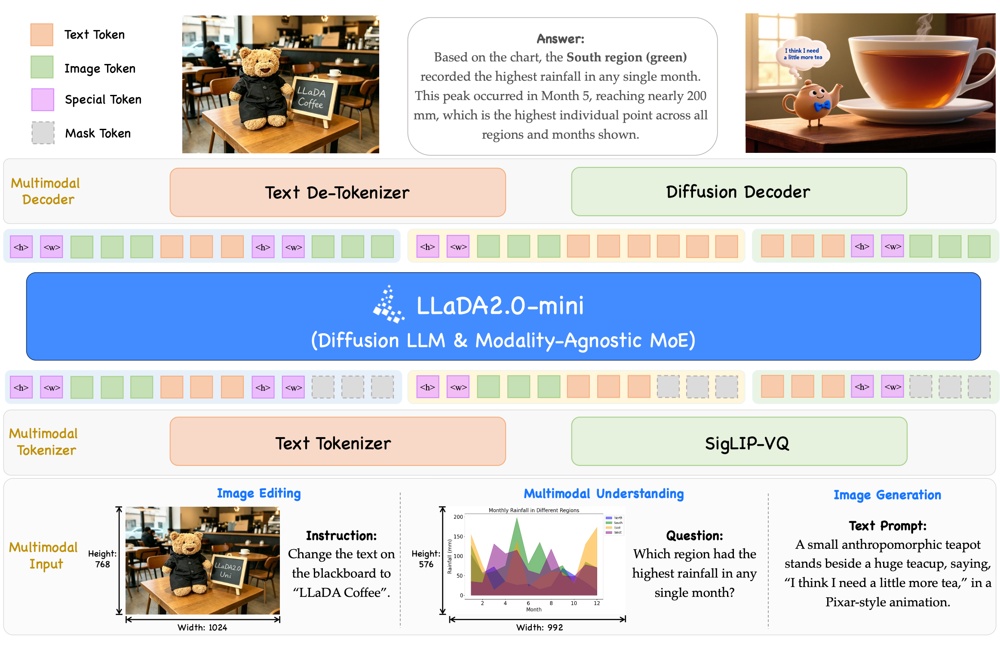

# LLaDA2.0-Uni

[LLaDA2.0-Uni](https://huggingface.co/inclusionAI/LLaDA2.0-Uni) accepts text and image input and supports text output, text-to-image generation, and image editing.

## Highlights

- Unified dLLM-MoE Backbone — Built on LLaDA 2.0, unifying multimodal understanding and generation.
- Top-Tier Understanding & Generation — Matches dedicated VLMs in visual QA and document understanding, while generating high-quality images.
- Interleaved Generation & Reasoning — Empowered by unified discrete representations, unlocking interleaved generation and reasoning.

## Architecture



LLaDA2.0-Uni unifies multimodal understanding and generation into a simple Mask Token Prediction paradigm. Visual inputs are encoded by the SigLIP-VQ tokenizer into discrete semantic tokens, then mapped alongside text tokens to backbone hidden states under a unified mask prediction objective. Output tokens are decoded back to text via the Text De-Tokenizer, or reconstructed into high-fidelity images through the Diffusion Decoder. Empowered by unified discrete representations, it effortlessly handles complex interleaved generation and unlocks advanced interleaved reasoning, interleaving <|image|>...<|/image|> chunks to enable end-to-end training and inference within a single coherent framework.

## Prerequisites

Install `sglang-omni` by following [Installation](../get_started/installation.md).

## Server Configuration

The default `omni` pipeline runs preprocessing, image encoding, and the
DLLM thinker, then routes to text and image decoders. The image decoder
uses diffusers' ZImage backbone, SigVQ conditioning, and a VAE. This is
LLaDA2-Uni's semantic decoder, not the LLaDA-Image text-conditioned model.
The `text` variant retains the four-stage text-output pipeline.

The CFG thinker currently uses synchronous eager execution. An explicit
CUDA graph request is rejected until CFG graph metadata is supported.

```bash
sgl-omni serve --model-path inclusionAI/LLaDA2.0-Uni --port 8000 \
  --thinker.engine.enable_torch_compile false
```

The cookbook explicitly disables `torch.compile` to match the validated
generation settings. CUDA Graph execution is controlled separately.

## Image Generation and Editing

Use `POST /v1/images/generations` for T2I and `POST /v1/images/edits` for
editing. These routes use SGLang Diffusion's image request and response
schemas while executing Omni's Thinker and selected image decoder backend.
`dllm_steps` controls VQ token generation; `num_inference_steps` controls
decoder diffusion sampling. `guidance_scale` sets Thinker CFG, not an
additional CFG pass in the image decoder.

```python
import base64
from pathlib import Path

import requests

request = {
    "model": "inclusionAI/LLaDA2.0-Uni",
    "prompt": "A sailboat on a calm lake.",
    "size": "1024x1024",
    "response_format": "b64_json",
    "decode_mode": "decoder-turbo",
    "num_inference_steps": 8,
    "dllm_steps": 8,
    "guidance_scale": 4.0,
    "seed": 42,
}
response = requests.post(
    "http://localhost:8000/v1/images/generations", json=request, timeout=600
)
response.raise_for_status()
image = response.json()["data"][0]
Path("generated.png").write_bytes(base64.b64decode(image["b64_json"]))
```

Edits accept multipart form data with exactly one `image`/`image[]` upload or
`url`/`url[]` reference. Dimensions follow the processed source grid; omit
`size`, `width`, and `height`. Set `cfg_text_scale` and `cfg_image_scale` for
editing guidance. Omitting them retains the model's task-specific defaults.

```bash
curl http://localhost:8000/v1/images/edits \
  -F 'image=@source.png' \
  -F 'prompt=Change the background to a beach.' \
  -F 'response_format=b64_json' \
  -F 'decode_mode=decoder-turbo' \
  -F 'num_inference_steps=8' \
  -F 'cfg_text_scale=4.0' -F 'cfg_image_scale=1.5' -F 'seed=42'
```

Both routes are non-streaming, support one PNG (`n=1`), and return
`{id, created, data: [...]}`. `response_format=b64_json` returns raw base64;
`response_format=url` returns an inline PNG data URL without server-side file
retention. T2I accepts either `size` or paired `width`/`height`, defaulting to
1024x1024. Unsupported native sampling controls are rejected rather than ignored.
The old chat image-generation entrypoint remains available for existing clients.

For thinking T2I, set `mode: "thinking"`. To retrieve both thinking text and
the image, use `/v1/chat/completions` with `modalities: ["text", "image"]`
and `image_generation.mode: "thinking"`.
The text pass has a 2048-token budget and stops at `<boi>`. The image pass
retains the generated context and applies CFG to the VQ tokens. Both passes
must fit the thinker's configured context length. Thinking mode does not
support editing.

The server selects a patch-aligned source grid near a 512x512 pixel budget,
then resizes proportionally and center-crops the image to that grid. Small
images are enlarged without black padding; images already matching the grid
are preserved. Aspect ratios beyond 4:1 or 1:4 require additional cropping.
Image understanding retains its separate preprocessing and pixel budgets.

## Text Input

Send a text-only prompt and get a text response.

**cURL**

```bash
curl -X POST http://localhost:8000/v1/chat/completions \
  -H "Content-Type: application/json" \
  -d '{
    "model": "inclusionAI/LLaDA2.0-Uni",
    "messages": [{"role": "user", "content": "Hello!"}],
    "max_tokens": 256
  }'
```

**Python**

```python
import requests

resp = requests.post(
    "http://localhost:8000/v1/chat/completions",
    json={
        "model": "inclusionAI/LLaDA2.0-Uni",
        "messages": [{"role": "user", "content": "Hello!"}],
        "max_tokens": 256,
    },
)
resp.raise_for_status()
result = resp.json()
print(result["choices"][0]["message"]["content"])
```

## Image and Text Input

Send an image with a text prompt to get a text response.

**cURL**

```bash
curl -X POST http://localhost:8000/v1/chat/completions \
  -H "Content-Type: application/json" \
  -d '{
    "model": "inclusionAI/LLaDA2.0-Uni",
    "messages": [{"role": "user", "content": "Briefly describe the cars in this image."}],
    "images": ["tests/data/cars.jpg"],
    "modalities": ["text"],
    "max_tokens": 16
  }'
```

**Python**

```python
import requests

resp = requests.post(
    "http://localhost:8000/v1/chat/completions",
    json={
        "model": "inclusionAI/LLaDA2.0-Uni",
        "messages": [{"role": "user", "content": "Briefly describe the cars in this image."}],
        "images": ["tests/data/cars.jpg"],
        "modalities": ["text"],
        "max_tokens": 16,
    },
)
resp.raise_for_status()
result = resp.json()
print(result["choices"][0]["message"]["content"])
```

Images can also be passed inline using the OpenAI multi-content format:

```python
import requests

resp = requests.post(
    "http://localhost:8000/v1/chat/completions",
    json={
        "model": "inclusionAI/LLaDA2.0-Uni",
        "messages": [
            {
                "role": "user",
                "content": [
                    {"type": "image_url", "image_url": {"url": "tests/data/cars.jpg"}},
                    {"type": "text", "text": "Briefly describe the cars in this image."},
                ],
            }
        ],
        "modalities": ["text"],
        "max_tokens": 16,
    },
)
resp.raise_for_status()
result = resp.json()
print(result["choices"][0]["message"]["content"])
```

## Request Parameters

The table below lists all parameters accepted by the `/v1/chat/completions` endpoint for LLaDA2.0-Uni.

| Parameter | Type | Default | Description |
|---|---|---|---|
| `model` | string | `null` | Model identifier |
| `messages` | list | (required) | List of chat messages, each with `role` and `content` |
| `modalities` | list | `["text"]` | Use `["text"]` for understanding or `["image"]` for generation/editing |
| `image_generation` | object | `null` | Image generation options shown above |
| `images` | list | `null` | List of image file paths (local paths or URLs) |
| `max_tokens` | int | `null` | Maximum number of tokens to generate |

### Incoming Features

- Interleaved Generation

## Known Limitations

- Image generation and editing return one image per non-streaming request.
- Interleaved generation is not supported.
