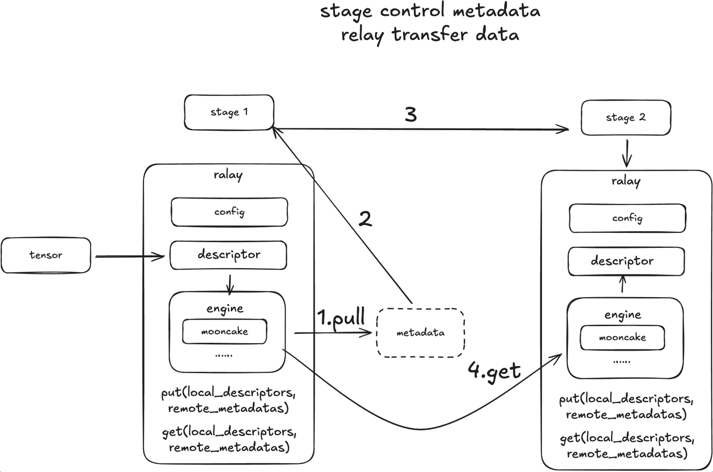

# 中继层 (Relay) 设计

## 动机 (Motivation)

Relay 专为分布式系统中的高效数据传输而设计，利用了 RDMA 及其他传输协议。它促成了集群节点间快速、低延迟的数据移动，并原生支持 NVLink、RDMA 和 TCP。为了将 Omni 模型分解为编码器、自回归模型、扩散模型和解码器等各个阶段，我们必须考虑到它们显著差异的计算强度和非均匀的扩展需求（部署比例绝不是 1:1:1）。因此，这些阶段必须部署在分散且异构的计算资源上。

为了桥接这些阶段，我们引入了 **Relay**（中继层），旨在这种异构环境中编排激活值（activations）的传输。该引擎专门解决以下三种传输场景：

- **设备内 (Intra-Device)：** 当两个阶段作为独立的进程运行在同一张 GPU 上时，系统必须确保提供 **零拷贝 (zero-copy)** 机制，以消除任何多余的显存 (VRAM) 复制。

- **节点内 (Intra-Node)：** 对于单个节点内的跨 GPU 通信，最优路径是 **NVLink P2P**。系统应优先使用它，实在不行才回退到 RDMA，最后才使用共享内存 (SHM) 作为兜底。

- **节点间 (Inter-Node)：** 对于节点间的通信，优先选择 **多节点 NVLink (Multi-Node NVLink)**（利用诸如 GB200 MMNVL 等特性）。次优选项是 RDMA (InfiniBand/RoCE)，而标准的 TCP/IP 则作为最终的后备方案。

传输引擎的首要目标是抽象掉这些底层的传输细节，让上层的处理阶段能够纯粹专注于计算。当前的框架往往很难同时无缝覆盖这三种场景。虽然 `torch.distributed` 能有效处理节点内通信，但在满足长期的节点间需求方面却显得力不从心。然而，**Mooncake** 在高效解决这全部三层传输需求方面展现出了显著的优势。


## 架构设计 (Design)

*(译注：请参考英文原版文档的架构图)*


## API 设计 (API Design)

下面我们将使用一个基于 NIXL 后端的示例来演示 API。我们可以为不同的阶段创建不同的连接器 (connectors)，然后使用 `put_async` 和 `get_async` API 在它们之间传输数据。

```python
import torch
from sglang_omni.relay import NixlRelay
import asyncio

async def test_nixl():
    # 初始化发送端的 Relay
    stage1_connector = NixlRelay(
        engine_id="stage0",
        device="cuda:0"
    )

    # 初始化接收端的 Relay
    stage2_connector = NixlRelay(
        engine_id="stage2",
        device="cuda:1"
    )

    # 准备要发送的张量
    tensor_to_transport = torch.randn(4, 128, device=stage1_connector.device)
    put_op = await stage1_connector.put_async(tensor_to_transport)
    metadata = put_op.metadata

    # 准备接收端的张量缓冲区
    tensor_to_receive = torch.zeros(4, 128, device=stage2_connector.device)
    get_op = await stage2_connector.get_async(metadata, tensor_to_receive)

    # 等待收发操作完成
    await get_op.wait_for_completion()
    await put_op.wait_for_completion()

    # 校验数据是否被正确传输
    # 注意：我们需要将它们移动到相同的设备（如 CPU）上才能进行比较
    assert torch.equal(tensor_to_transport.cpu(), tensor_to_receive.cpu())
    print("Data transferred correctly (数据传输正确)")

if __name__ == "__main__":
    asyncio.run(test_nixl())
```

## 支持的后端 (Supported Backends)

Relay 为所有受支持的后端提供了一套统一的 API。目前，我们支持：
- `NCCL` (NVIDIA 集合通信库)
- `SHM` (共享内存)
- `NIXL`
- `Mooncake`
