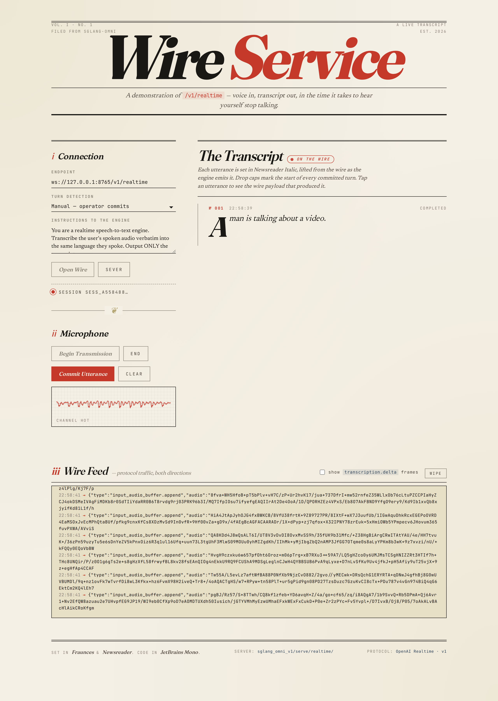

# Wire Service — /v1/realtime web demo



Editorial-broadsheet single-page client for `/v1/realtime`. Captures
the microphone and streams PCM16 chunks to the WebSocket. The user can select
text-only output or text plus streamed PCM16 audio. Vanilla HTML/CSS/JS — no
build step.

## Run

1. **Start the server** with one of these configurations:

   Text output only (one GPU; matches the playground default):

   ```bash
   sgl-omni serve \
     --model-path Qwen/Qwen3-Omni-30B-A3B-Instruct \
     --text-only \
     --port 8765 \
     --enable-realtime
   ```

   Text and audio output on one H200:

   ```bash
   sgl-omni serve \
     --model-path Qwen/Qwen3-Omni-30B-A3B-Instruct \
     --config examples/configs/qwen3_omni_colocated_h200.yaml \
     --colocate \
     --port 8765 \
     --enable-realtime
   ```

   Text and audio output on two GPUs:

   ```bash
   python examples/run_omni.py qwen3-speech-server \
     --model-path Qwen/Qwen3-Omni-30B-A3B-Instruct \
     --gpu-thinker 0 \
     --gpu-talker 1 \
     --gpu-code-predictor 1 \
     --gpu-code2wav 1 \
     --port 8765 \
     --enable-realtime
   ```

2. **Serve this directory** over HTTP (browsers won't grant
   `getUserMedia` to `file://`):

   ```bash
   cd playground/qwen-omni/realtime
   python -m http.server 8080
   ```

3. **Open** <http://127.0.0.1:8080> in a modern browser. Choose an output mode,
   click **Open Wire**, then **Begin Transmission**,
   and start speaking. The output mode is locked for the duration of the
   connection. **Text + audio** requires one of the speech-server configurations.

## What you'll see

| UI panel | Meaning |
|---|---|
| **Endpoint** | WebSocket endpoint to connect to. |
| **Output** | Defaults to **Text only**, which requests `["text"]` and displays the assistant reply followed by the user's verbatim transcript. **Text + audio** requests `["text", "audio"]`, plays the streamed spoken response, and displays only the assistant reply. |
| **Instructions** | System prompt sent in `session.update`. Affects the assistant reply only — transcription always runs verbatim. |
| **Responses** | Each VAD-driven turn appears as a card. Assistant text is rendered from `response.text.delta`; text-only mode also renders `conversation.item.input_audio_transcription.delta`. |

## Notes

- VAD is always on server-side; there's no manual commit. Just speak,
  pause, and the server picks up the turn.
- The page constructs its own `AudioWorklet` inline so there's no build
  step / package.json required.
- Audio is captured at 16 kHz, converted to PCM16 little-endian, and
  base64-encoded into `input_audio_buffer.append` frames.
- Text-only mode requests only the `text` modality.
- Text + audio mode requests both modalities. Audio deltas are mono 24 kHz
  PCM16 little-endian and are queued with Web Audio for gapless playback.
- Server-owned barge-in is the default behavior for text-plus-audio sessions.
  The server cancels the active response when new speech starts, while the
  browser stops queued PCM playback. The interrupted user transcription remains
  in conversation history before the next queued response starts.
- Text-only mode keeps its existing behavior and finishes the active response.
- Custom realtime applications get the same behavior by requesting
  `["text", "audio"]`. They must also stop any assistant audio already buffered
  for local playback when they receive `input_audio_buffer.speech_started`.
- To opt out for a specific audio session, set:

  ```json
  {
    "type": "session.update",
    "session": {
      "modalities": ["text", "audio"],
      "turn_detection": {
        "type": "server_vad",
        "interrupt_response": false
      }
    }
  }
  ```
- The standalone `/v1/audio/speech` TTS API is unchanged because it does not
  have a live microphone/VAD session to trigger barge-in.
- The page does no error handling beyond updating the status line —
  matching the project's house style. If the WS drops mid-session,
  reconnect.
